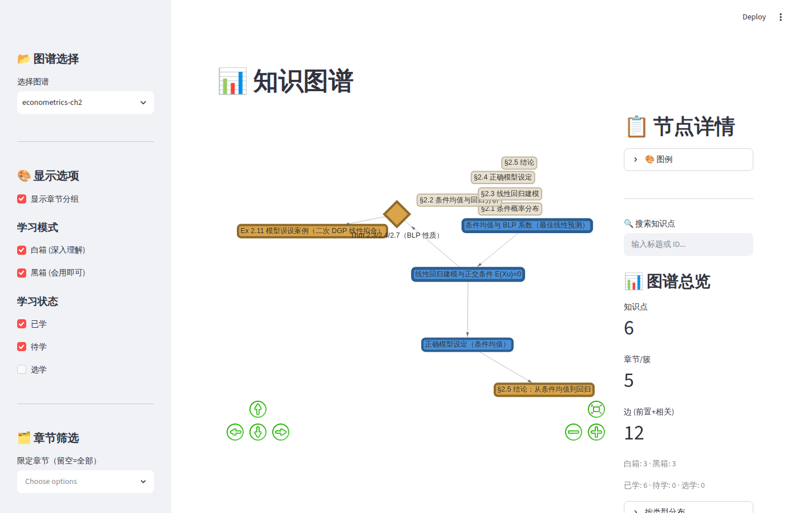
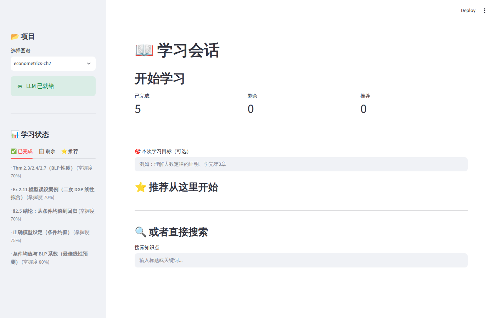
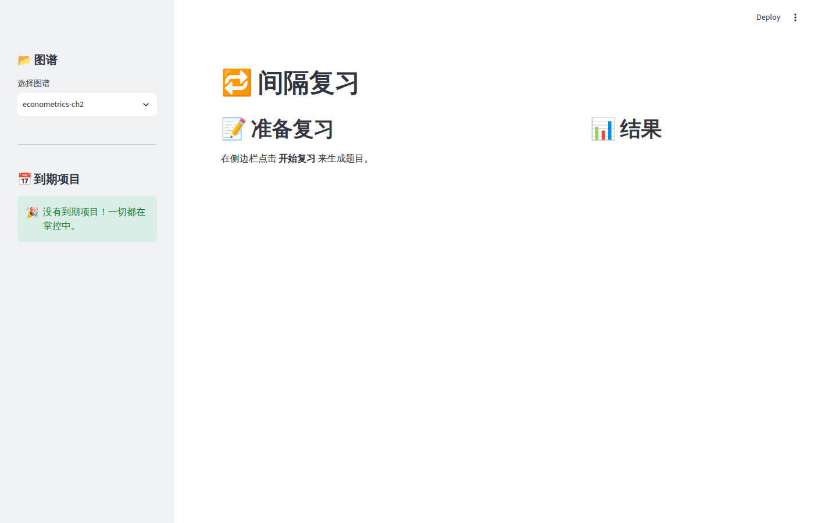

# 活书 huoshu 📚

> **把教材变成可交互知识图谱的自学工具** — Knowledge Graph × Adaptive Learning × RAG × Spaced Repetition
>
> 中文名「活书」：教材不再是线性翻页，而是可导航、可追问、可复习的活的知识网络。

[](https://www.python.org/)
[](LICENSE)
[](https://pypi.org/project/learning-agent/)
[](https://pypi.org/project/learning-agent/)
[](https://github.com/MXC-CKK/huoshu/actions)
[](tests/)

---

## 🎯 项目简介

活书（huoshu）是一个**把教材变成可交互知识图谱**的自主学习工具。它将任意教材内容抽取为原子知识点，在知识图谱中建立前置/相关关系，结合 IRT 自适应掌握度模型、SM-2 间隔复习和 RAG 教材检索，实现个性化的 Socratic 式学习闭环。

### 核心理念

- 📚 **教材是根**：每个知识点锚定教材原文（页码/章节），LLM 解释但不凭空编造
- 🧭 **图谱导航**：前置依赖边告诉你先学什么，相关边帮你建立横纵联系
- 🧠 **自适应掌握**：IRT 2PL 模型追踪每个知识点的掌握度，黑箱（会用）vs 白箱（深入理解）区分要求
- 🔁 **间隔复习**：基于 SM-2 的智能复习调度，弱项回炉、强项长周期
- 🤖 **LLM 教学**：DeepSeek/OpenAI/Ollama 可配置，Socratic 引导优先，不灌答案

---

## ✨ 功能

| 模块 | 功能 |
|------|------|
| 📊 **知识图谱可视化** | 交互式 vis.js 图谱，白箱蓝色/黑箱琥珀色，掌握度热力边框，点击节点查看详情 |
| 📖 **学习会话** | 图谱导航（下钻/返回）、Socratic LLM 问答、三栏迷航（已完成/剩余/推荐） |
| 📖 **教材检索** | PDF 入库 → ChromaDB 向量化 → 自然语言检索，返回原文段落 + 精确页码（CLI + Web UI） |
| 🔁 **间隔复习** | 到期知识点自适应出题（基础/理解/应用），答题后自动更新掌握度并重排复习日期 |
| ⚙️ **模型设置** | DeepSeek / OpenAI / Ollama 统一配置：API Key、Base URL、代理、温度，保存即生效 |

---

## 🏗️ 架构

```
huoshu/
├── src/learning_agent/
│   ├── core/           # 数据层: 图谱加载/校验/导航, IRT 掌握度, SM-2 调度
│   │   ├── graph.py    # Bookmap 知识图谱
│   │   ├── mastery.py  # IRT 2PL 掌握度模型
│   │   └── scheduler.py # SM-2 间隔复习调度
│   ├── rag/            # RAG 教材检索
│   │   ├── ingest.py   # PDF 解析+分块+ChromaDB 入库
│   │   ├── retrieve.py # 语义检索+页码引用
│   │   └── cli.py      # CLI 验证入口
│   ├── ui/             # UI 层 (纯逻辑引擎 + Streamlit 页面)
│   │   ├── graph_renderer.py  # Bookmap → vis.js 转换
│   │   ├── study_engine.py    # 学习会话引擎
│   │   ├── review_engine.py   # 复习引擎
│   │   ├── pages_graph.py     # 图谱可视化页
│   │   ├── pages_study.py     # 学习会话页
│   │   ├── pages_search.py    # 教材检索页
│   │   ├── pages_review.py    # 间隔复习页
│   │   └── pages_settings.py  # 模型设置页
│   ├── llm.py          # LLM 客户端 (DeepSeek/OpenAI/Ollama)
│   └── data/           # 数据工具
├── tests/              # 310 tests
├── examples/           # 示例图谱
└── pyproject.toml
```

---

## 🚀 快速开始

### 环境要求

- Python ≥ 3.12
- [Ollama](https://ollama.com) — 教材检索（embedding）与本地 LLM 需要；图谱/学习/复习页不依赖

### 安装（二选一）

**方式 A：pip 安装（推荐，开箱即用）**

```bash
pip install learning-agent
```

装好后 `huoshu` 命令直接可用。

**方式 B：源码运行（开发者）**

```bash
git clone https://github.com/MXC-CKK/huoshu.git
cd huoshu
pip install -e .
```

### 配置 LLM（可选，用于 Socratic 教学和智能出题）

```bash
# DeepSeek（默认，国内直连）
export LLM_API_KEY=sk-your-deepseek-key

# 或 OpenAI（需海外网络）
export LLM_PROVIDER=openai
export LLM_API_KEY=sk-your-openai-key

# 或 Ollama 本地（免费，无需 API key）
export LLM_PROVIDER=ollama
```

> 💡 Windows 用户：把 `export` 换成 `set`（PowerShell 用 `$env:LLM_API_KEY="..."`）。
> 更简单的方式：在应用内「⚙️ 模型设置」页填写，保存后立即生效，无需碰环境变量。

LLM 未配置时，学习和复习功能仍可用（自动降级为模板引导和关键词判分）。

### 启动

```bash
huoshu
```

- 浏览器自动打开 **http://localhost:8501**（未自动打开则手动访问该地址）
- 端口被占用时指定端口：`huoshu --server.port 8600`
- 源码方式两条路都行：`huoshu` 或 `streamlit run src/learning_agent/main.py`
- 使用虚拟环境（venv/conda）的记得先激活：Linux/macOS `source .venv/bin/activate`；Windows `.venv\Scripts\activate`

启动后通过**左侧边栏**在 5 个页面间切换：

| 页面 | 功能 |
|------|------|
| 📊 知识图谱 | 图谱浏览、节点搜索、掌握度热力 |
| 📖 学习会话 | Socratic 问答、下钻导航、迷航三栏 |
| 📖 教材检索 | PDF 入库、语义检索、集合管理 |
| 🔁 间隔复习 | 到期项自适应出题 |
| ⚙️ 模型设置 | LLM 提供商/Key/代理配置 |

### 首次使用 Checklist

1. **Ollama 就绪**（教材检索需要）：启动 Ollama 后运行 `ollama pull nomic-embed-text`
2. **准备教材 PDF**：打开检索页直接拖拽上传 PDF（推荐）；也可手动放入 `~/.huoshu/pdf/`（Windows: `C:\Users\<你>\.huoshu\pdf\`）
3. **准备图谱文件**：bookmap JSON 放到 `./bookmap/` 或 `~/.huoshu/bookmap/`（或用 `HUOSHU_BOOKMAP_DIR` 指定），图谱页侧边栏即可选择
4. **配置 LLM**（可选）：见上，用于 Socratic 教学

### 单页独立启动（高级用法）

```bash
streamlit run src/learning_agent/ui/pages_graph.py   # 图谱可视化
streamlit run src/learning_agent/ui/pages_study.py   # 学习会话
streamlit run src/learning_agent/ui/pages_review.py  # 间隔复习
streamlit run src/learning_agent/ui/pages_search.py  # 教材检索
```

### CLI 操作（无需 UI 的 RAG 入库/检索）

```bash
python -m learning_agent.rag.cli ingest textbook.pdf --name mybook
python -m learning_agent.rag.cli search "大数定律证明" --name mybook
```

### 运行测试

```bash
pip install -e ".[dev]"
pytest tests/ -v
```

---

## 📖 使用指南

### 1. 准备图谱文件

按照 [bookmap-schema.json](https://github.com/MXC-CKK/huoshu/blob/main/framework/bookmap-schema.json) 格式创建知识图谱 JSON，或使用 `examples/demo-math.json` 快速体验。

### 2. 图谱浏览

打开图谱可视化页，选择 bookmap JSON 文件：
- 🟦 蓝色节点 = 白箱（深入理解），🟨 琥珀节点 = 黑箱（会用即可）
- 边框粗细 = 掌握度（越粗越稳）
- 搜索知识点 → 查看前置链、相关概念、教材锚点

### 3. 学习

在学习会话页中：
- 设定学习目标，系统推荐入口
- 下钻知识点时自动保存 breadcrumb，随时返回
- 提问时 LLM 用 Socratic 方法引导，锚定教材原文

### 4. 教材检索

在教材检索页中（需本地运行 Ollama）：
1. 切换到「📥 入库」Tab → 拖拽上传 PDF（推荐），或从已放入 `~/.huoshu/pdf/` 的目录中选择
2. 设置集合名称和分块参数 → 点击入库（自动向量化存入 ChromaDB）
3. 切换到「🔍 检索」Tab，输入自然语言问题 → 查看原文段落及页码引用
4. 可在「🗂 集合管理」Tab 查看统计信息或删除不再需要的集合

### 5. 复习

在复习页中：
- 系统自动筛选到期知识点
- 按掌握度自适应出题（基础→理解→应用）
- 答题后自动更新掌握度并重排复习日期

---

## 🔬 技术选型

| 场景 | 方案 |
|------|------|
| UI | Streamlit + streamlit-agraph (vis.js) |
| 向量库 | ChromaDB（本地持久化） |
| Embedding | Ollama nomic-embed-text（默认本地）/ OpenAI |
| LLM | DeepSeek（默认）/ OpenAI / Ollama（统一接口） |
| PDF 解析 | pdfplumber |
| 图谱模型 | 自研 Bookmap Schema（纯 JSON，无外部依赖） |
| 掌握度 | 简化 IRT 2PL 模型 + hypercorrection |
| 间隔调度 | SM-2 变体（1/3/7/14/30/60/120 天） |

---

## 📸 截图

### 📊 知识图谱



### 📖 学习会话



### 🔁 间隔复习



> 截图来自 v0.1.x；📖 教材检索页截图待补充。

---

## 📄 许可

MIT License — 详见 [LICENSE](LICENSE)。

---

## 🙏 致谢

- 参考设计：[benkyo](https://github.com/youseiushida/benkyo)（MIT）
- 图谱格式受 [learning-agent](https://github.com/MXC-CKK/learning-agent) 启发
